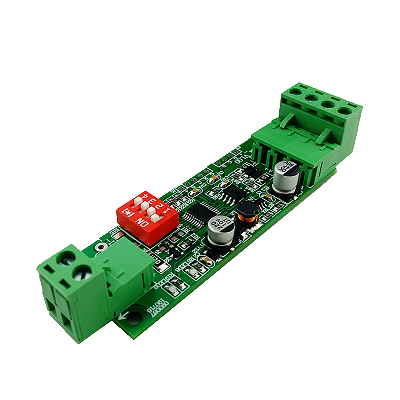
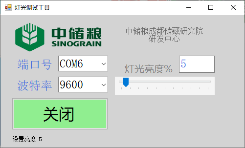
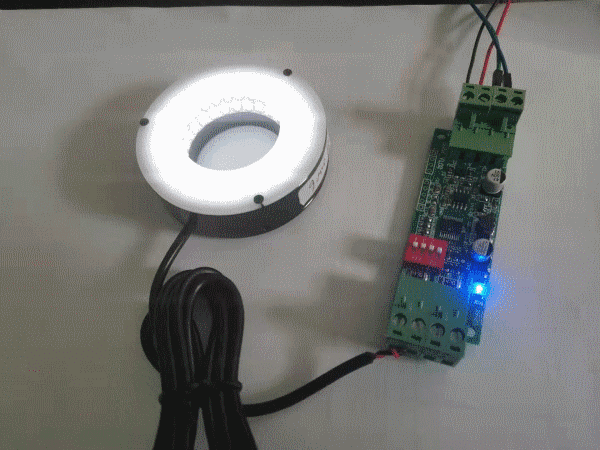

# 调光模块测试软件

winxos 20210520

模块购买地址：[MODBUS调光模块输入7-40V](https://item.taobao.com/item.htm?id=600575960946)

#### 模块参数

1. 输入电压7-40VDC，根据输出驱动的LED灯具选择输入电压（灯具31VDC则输入电压36VDC）

2. 输出1路（根据需要可以设置2路）调光，频率约300HZ，调光范围0%-100%，出厂50%。

3. 通过485-MODBUS RTU通讯，可读写保持寄存器0-3进行修改参数：

   保持寄存器0：设备ID，范围1-15,出厂设置1（注意区分内部ID/外部ID）；
   保持寄存器1：通讯波特率，范围4800-19200，出厂设置9600；
   保持寄存器2：保留，出厂设置50；
   保持寄存器3：调光，范围0-100，出厂设置50（即亮度50%）；

4. 通讯串口设置：波特率，8位数据，1位停止位，无奇偶校验位；

#### 项目内容

本项目为上述调光模块的调光软件，使用方式为设置好端口号和波特率点击连接后，拖动亮度调节滑块进行亮度调节。软件界面如下图：

实物运行效果如下图：

